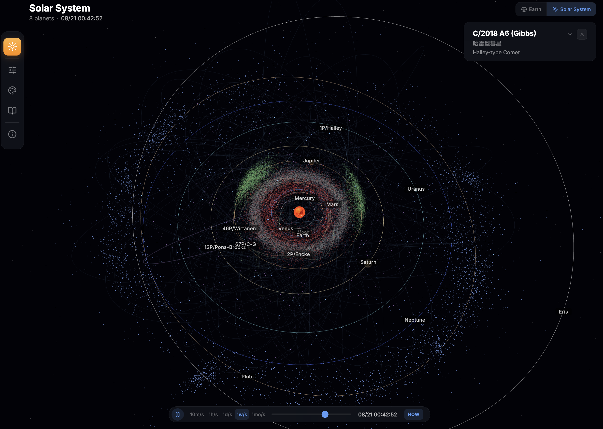

# Satellite Arc

3D 即時衛星軌道追蹤 + 太陽系模擬視覺化。純 Three.js 渲染，瀏覽器端即時計算。

**雙模式切換：**
- **Earth Mode** — 從 Supabase 載入 ~15,000 顆衛星（含太空碎片）的 TLE 軌道參數，用 satellite.js 在瀏覽器即時計算位置，以 Three.js 渲染在 3D 地球上
- **Solar System Mode** — 8 大行星 + 月球 + 矮行星 + 彗星 + 86,549 顆真實小天體（JPL SBDB），Keplerian 軌道即時計算

### Earth Mode


### Solar System Mode



## 功能

### 核心渲染
- **3D 地球** — 日夜交替 shader（Blue Marble 白天 + Black Marble 夜晚 + 即時晨昏線）+ Fresnel 大氣光暈
- **~15,000 顆衛星** — 即時 SGP4 位置計算，分批更新保持 60fps
- **11 種用途分類** — 星鏈 / 寬頻通訊 / 衛星電話 / 導航定位 / 地球觀測 / 科學太空站 / 軍事情報 / 技術展示 / 太空碎片 等
- **動態尾巴** — 歷史位置緩衝區（20-50 步），零額外 SGP4 計算
- **3D 軌道線** — 依真實高度映射（LEO 貼球面、GEO 遠離球面），清晰區分軌道層

### 相機控制
- **旋轉 / 縮放 / 平移** — 左鍵旋轉、滾輪縮放、右鍵平移
- **5 個預設視角** — 北極俯視、南極俯視、赤道正視、全景遠距、特寫近距
- **衛星追蹤模式** — 選中衛星後，相機平滑跟隨繞行地球

### 側邊欄面板
- **設定** — 用途分類開關（Solo 模式快速切換）、顯示參數（尾巴/軌道線/日夜交替）、視覺參數
- **篩選圖層** — 依衛星系統 / 國家 / 用途三維篩選 + 搜尋
- **配色主題** — 4 組預設（Default / Warm / Cool / Mono）+ 自訂
- **統計** — 衛星總數、軌道分佈、用途圓餅圖、主要營運商
- **視角** — 5 個預設相機視角快切

### 太空發射
- **全球發射台標記** — 233 個發射台地表標記，即將發射的台站顯示脈衝動畫（< 24h 紅色 / < 7d 橘色）
- **發射時程面板** — 近期已發射（過去 7 天）+ 即將發射的任務列表，含倒數計時、狀態 badge、軌道類型
- **點擊飛到發射台** — 點擊任務，相機平滑飛到對應發射台位置
- **發射詳情卡片** — 火箭圖片、任務描述、機構、軌道參數、天氣、成功機率
- **資料來源** — Launch Library 2 (TheSpaceDevs)，每日自動同步 upcoming + 回溯歷史 5 年

### 太陽系模式（Solar System Mode）

**場景渲染**
- **8 大行星** — 2K 貼圖（Solar System Scope CC BY 4.0）+ 大氣光暈 + CSS2D 標籤
- **太陽** — 貼圖 + 輝光 shader + 脈動動畫
- **月球** — 貼圖 + 即時軌道位置（含升交點進動）
- **土星環** — 貼圖 + 傾角
- **矮行星** — Pluto、Eris + 軌道路徑
- **5 顆著名彗星** — Halley、Encke、Pons-Brooks、Churyumov-Gerasimenko、Wirtanen
- **星空背景** — 3,000 顆恆星 + 黃道面格線

**86,549 顆真實小天體**（JPL Small-Body Database → Supabase）
| 類別 | 數量 | 說明 |
|------|------|------|
| MBA 主帶小行星 | 40,000 | 火星-木星間（取樣） |
| TJN 木星特洛伊 | 15,838 | L4/L5 拉格朗日點群聚（全量） |
| NEO 近地天體 | 23,543 | Apollo 型，軌道穿越地球（全量） |
| TNO 柯伊伯帶 | 6,033 | 海王星外（全量） |
| CEN 半人馬 | 1,008 | 木星-海王星間（全量） |
| HTC 哈雷型彗星 | 110 | 含軌道路徑（全量） |
| JFC 木星族彗星 | 17 | 含軌道路徑（全量） |

**太陽系側邊欄**
- **設定** — 7 類小天體獨立開關（帶數量）、每類粒子大小/不透明度可調、軌道路徑分三組（行星/HTC/JFC）獨立開關 + 透明度
- **配色主題** — 4 組預設（Default / Warm / Cool / Mono）+ 7 類自訂色
- **天體百科** — 7 類小天體中文百科（簡介、形成、已知數量、重要性），含 NASA 任務參考

**互動**
- **點擊天體** — 點擊行星/彗星/矮行星/太陽/月球/HTC/JFC 粒子顯示資訊卡
- **飛行視角** — 點擊後相機 ease-out 平滑飛到天體附近
- **時間加速** — 10min/s ~ 1month/s，時間軸 ±1 年
- **平滑移動** — 雙快取 lerp 內插，所有速度下零頓感

**載入體驗**
- 切換到太陽系模式時，自動從 Supabase 載入 86,549 筆小天體資料
- 載入過程顯示 overlay 提示（「Loading small body data...」→「Computing 86,549 orbits...」）
- 7 個類別平行載入 + Range header 自動分頁，約 2-3 秒完成
- 載入後純 client-side 計算，不再需要網路請求

**軌道計算**
- Keplerian 軌道力學 — Newton-Raphson 解 Kepler 方程（低 e: 3 次迭代，高 e: 8 次）
- 行星位置：J2000 軌道要素 + 每 30 幀計算 + 每幀 lerp
- 小天體位置：每 60 幀批量 Kepler solve 86k 顆 + 每幀 lerp
- 距離縮放：`√(AU) × 10`（行星大小誇張 ~500 倍，否則看不見）

### 使用者體驗
- **時間軸拖拉** — 可拖拉 ±12 小時，即時更新衛星位置
- **時間加速** — 10x ~ 600x，觀察衛星繞地球
- **點擊查看** — UCS 衛星目錄 7,560 筆（營運商、用途、發射資訊）
- **Info Modal** — 操作指南 / 資料來源 / 使用技巧 / 關於 / 個人，支援中英文
- **品牌 Loading** — 軌道動畫 + 步驟清單 + 平滑淡出過渡
- **Favicon** — 衛星軌道風格圖示
- **手機版 Responsive** — 底部水平工具列、底部滑出面板、自適應 Timeline

## 技術架構

```
CelesTrak (36 群組, 含碎片)          Launch Library 2 (TheSpaceDevs)
    ↓ data-collectors (每 2 小時)        ↓ data-collectors (每 5 分鐘輪轉)
Supabase satellite_tle               Supabase launches + launch_pads
    + satellite_catalog                  + launch_events
    ↓ satellite_classified view          ↓ launches_upcoming view
    ↓ PostgREST API                      ↓ PostgREST API
瀏覽器載入 TLE + category             瀏覽器載入 launches + pads
    ↓ satellite.js SGP4                  ↓
每幀分批計算衛星位置                   LaunchPadMarkers + LaunchPanel
    ↓ Three.js
InstancedMesh 光點 + 歷史緩衝區尾巴 + 3D OrbitLines + 發射台標記

JPL Small-Body Database (SBDB)
    ↓ scripts/fetch_small_bodies.py（一次性匯入）
Supabase small_bodies (86,549 筆)
    ↓ PostgREST API（分頁載入）
瀏覽器載入軌道要素
    ↓ Keplerian orbit solver（每 60 幀批量計算 + 每幀 lerp）
THREE.Points 粒子雲（7 類別，各色分開渲染）
```

### 效能策略

| 策略 | 說明 |
|------|------|
| 分批 SGP4 | 每幀只算 1/4 衛星，4 幀完成一輪 |
| 歷史緩衝區 | 尾巴用 Float64Array 環形緩衝（最多 55 幀），零 GC 壓力 |
| 零每幀分配 | Color / Matrix4 / Vector3 預分配重用，消除 GC 卡頓 |
| Tab 切換保護 | deltaTime cap 1s + 清空歷史緩衝，防止切回瞬間暴衝 |
| InstancedMesh | 3 層光點（core + glow1 + glow2）共 ~7 draw calls |
| 非同步篩選 | 篩選切換顯示 overlay，不凍結 UI |
| 淡出過渡 | Loading → 主畫面平滑淡出，Three.js 在背景預載 |

### 座標系

```
Earth radius = 1.0
高度用 sqrt 縮放：LEO 400km → r≈1.13 / MEO 20,000km → r≈1.9 / GEO 36,000km → r≈2.2
```

## 資料來源

| 來源 | 內容 | 更新頻率 |
|------|------|---------|
| **CelesTrak** (36 群組) → data-collectors → Supabase | TLE 軌道參數 (~15,000 顆，含太空碎片) | 每 2 小時 |
| **Launch Library 2** (TheSpaceDevs) → data-collectors → Supabase | 發射時程 + 233 發射台 + 太空事件 | 每 5 分鐘輪轉 |
| **UCS Satellite Database** → Supabase | 用途/營運商/發射資訊 (7,560 筆) | 靜態 |
| **NASA Black Marble** | 地球夜景貼圖 | 靜態 |
| **JPL SBDB** → scripts/fetch_small_bodies.py → Supabase | 小天體軌道要素 (86,549 筆，7 類) | 一次性匯入 |
| **Solar System Scope** | 行星 / 太陽 / 月球 2K 貼圖 (CC BY 4.0) | 靜態 |

### CelesTrak 群組清單

導航（GPS / Galileo / BeiDou / GLONASS）、通訊星座（Starlink / OneWeb / Iridium / Globalstar / Orbcomm / Qianfan）、氣象觀測（Weather / NOAA / GOES）、地球觀測（Resource / Planet / Spire）、同步軌道（GEO / SES）、太空站與科學（Stations / Science）、搜救與環境（SARSAT / Argos / TDRSS）、特殊軌道（Molniya / Military / Radar / Analyst）、小型衛星（CubeSat / Education / DMC）、社群追蹤（Amateur / SatNOGS / Visual）、**太空碎片**（Fengyun-1C / Cosmos-2251 / Iridium-33）

## 專案結構

```
src/
├── globe/                       ← 3D 地球渲染核心（Earth Mode）
│   ├── GlobeView.tsx            ← React 容器 + 相機預設/追蹤模式
│   ├── GlobeScene.ts            ← 場景管理 + 分批 SGP4 + 追蹤邏輯
│   ├── EarthMesh.ts             ← 地球球體 + Fresnel 大氣
│   ├── SatelliteOrbs.ts         ← InstancedMesh 衛星光點（呼吸動畫）
│   ├── TrailLines.ts            ← 歷史緩衝區動態尾巴
│   ├── OrbitLines.ts            ← 3D 靜態軌道弧線（真實高度映射）
│   ├── LaunchPadMarkers.ts      ← 發射台地表標記 + 脈衝動畫
│   └── coordinates.ts           ← 球面座標轉換 + altToRadius
├── solarsystem/                 ← 太陽系渲染核心（Solar System Mode）
│   ├── SolarSystemView.tsx      ← React 容器
│   ├── SolarSystemScene.ts      ← 場景管理 + Kepler solver + lerp + pick
│   ├── SunMesh.ts               ← 太陽球體 + 輝光 shader + 脈動
│   ├── PlanetMesh.ts            ← 行星球體 + 貼圖 + CSS2D label + 光暈
│   ├── OrbitPath.ts             ← 軌道橢圓線段
│   ├── planetData.ts            ← 行星/彗星/矮行星 Keplerian 軌道要素
│   ├── solarCoordinates.ts      ← Kepler 方程 + auToScene 縮放
│   └── solarBodyInfo.ts         ← 天體中文百科資料
├── components/
│   ├── Sidebar.tsx              ← 地球模式 Icon Rail + 7 面板
│   ├── SolarSidebar.tsx         ← 太陽系模式 Icon Rail + 3 面板（設定/配色/百科）
│   ├── ViewModeToggle.tsx       ← Earth / Solar System 切換按鈕
│   ├── LaunchPanel.tsx          ← 發射時程面板
│   ├── InfoModal.tsx            ← 操作指南（中英文）
│   └── LoadingScreen.tsx        ← 載入畫面
├── data/
│   ├── satelliteLoader.ts       ← 衛星 TLE 載入 + 11 分類
│   ├── launchLoader.ts          ← 發射資料載入
│   ├── smallBodyLoader.ts       ← 小天體軌道要素載入（Supabase 分頁）
│   └── satelliteInfo.ts         ← 中文俗名對照表
├── hooks/
│   └── useIsMobile.ts
├── App.tsx                      ← 雙模式狀態管理 + 條件渲染
└── main.tsx

scripts/
├── small_bodies_schema.sql      ← Supabase small_bodies 表 DDL
└── fetch_small_bodies.py        ← JPL SBDB → Supabase 一次性匯入腳本

public/textures/
├── earth-day.jpg, earth-dark.jpg
├── sun.jpg, mercury.jpg, venus.jpg, mars.jpg
├── jupiter.jpg, saturn.jpg, saturn_ring.png
├── uranus.jpg, neptune.jpg, moon.jpg
```

## 快速開始

```bash
# 安裝
npm install

# 設定環境變數
cp .env.example .env
# 編輯 .env 填入 Supabase URL 和 anon key

# 開發
npm run dev

# Type check
npm run typecheck

# Build
npm run build
```

## 環境變數

| 變數 | 說明 |
|------|------|
| `VITE_SUPABASE_URL` | Supabase PostgREST API URL |
| `VITE_SUPABASE_ANON_KEY` | Supabase anon key（公開，受 RLS 保護） |

## 部署

### Zeabur / Docker

```bash
# Dockerfile 已包含（Node 22 build + Nginx serve，port 8080）
# 在平台設定環境變數：VITE_SUPABASE_URL, VITE_SUPABASE_ANON_KEY
```

### 安全

- Supabase anon key 為公開 key（前端必定暴露）
- 所有衛星表已啟用 RLS：anon 只能 SELECT
- service_role key 僅 data-collectors 後端使用

## 操作

| 操作 | 說明 |
|------|------|
| 左鍵拖曳 | 旋轉地球 |
| 右鍵拖曳 | 平移地球 |
| 滾輪 | 縮放 |
| 點擊衛星 | 查看詳細資訊（NORAD ID、軌道、營運商等） |
| 點擊分類數字 | Solo 模式（只看這個分類） |
| 底部時間軸 | 播放/暫停、拖拉 ±12h、時間加速（10-600x）、重設為現在 |
| 側邊欄 | 設定 / 篩選 / 配色 / 統計 / 視角 / 發射時程 / Info |
| 追蹤按鈕 | 選中衛星後出現，相機跟隨衛星繞行 |
| 點擊發射任務 | 相機飛到發射台 + 顯示詳情卡片 |
| **Solar System 模式** | |
| Earth / Solar System 切換 | 右上角 pill toggle |
| 點擊行星/彗星 | 資訊卡 + 相機飛到天體 |
| 點擊 HTC/JFC 粒子 | 顯示彗星名稱 + 軌道參數 |
| 時間軸 | ±1 年，速度 10min/s ~ 1month/s |
| 側邊欄 | 設定（分類篩選+粒子控制）/ 配色 / 天體百科 |

## Roadmap

### 視覺增強
- **Cinema Mode** — keyframe 相機動畫、HQ 離線逐幀匯出、Vignette 暗角
- **Ground Track** — 衛星地面軌跡投影線

### 互動功能
- **Viewshed 視域分析** — 顯示選中衛星的地面可見範圍
- **衛星搜尋** — 搜尋衛星名稱 / NORAD ID，自動定位

### 資料擴充
- **Space-Track 整合** — 完整軍事/機密衛星 + 碰撞預警（CDM）
- **歷史回放** — 從 S3 歸檔載入過去 TLE，回放特定日期
- **太空天氣** — NASA DONKI / NOAA SWPC 太陽風暴、極光帶視覺化
- **ISS 即時追蹤** — Open Notify API 國際太空站位置標記

### 太陽系擴充
- **深空探測器** — JWST / Voyager / New Horizons 即時位置（JPL Horizons API → Supabase）
- **近地天體接近警報** — NASA CNEOS Close Approach API，即將接近地球的小行星通知面板
- **彗尾效果** — 彗星靠近太陽時的粒子拖尾視覺效果

### 效能優化
- **GPU Compute** — WebGPU compute shader 平行 SGP4，支援 10 萬+ 衛星（`perf/webgpu-sgp4` 分支開發中）
- **WebGPU Kepler** — 小天體位置計算移至 compute shader，支援 100 萬+

## 相關專案

| 專案 | 角色 |
|------|------|
| `data-collectors` | CelesTrak TLE（每 2h）+ Launch Library 2 發射時程（每 5min 輪轉）→ Supabase |
| `gis-platform` | Supabase schema + UCS 衛星目錄 + satellite_classified view（11 category）+ pg_cron 自動分區 |
| `plan-art` | 航班軌跡視覺化（同系列） |

## 授權

MIT License
